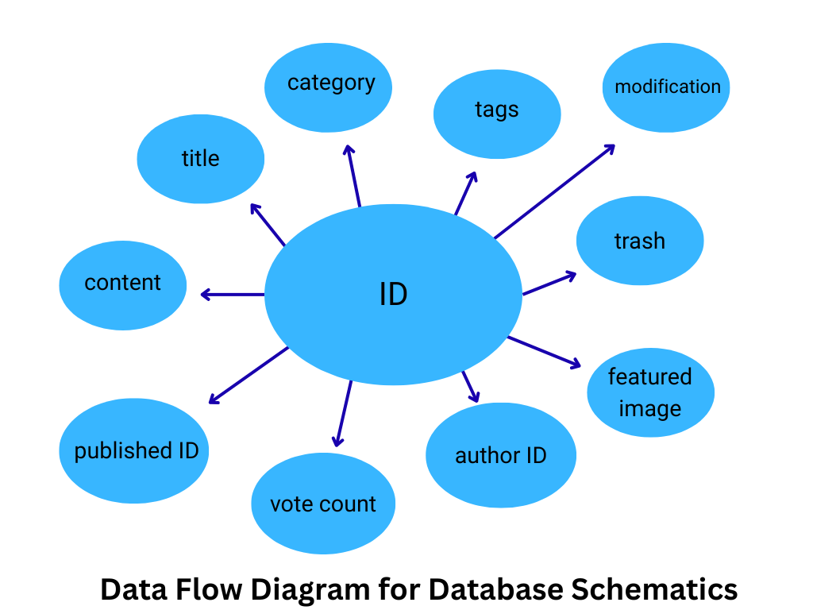

<h1 className="text-3xl md:text-4xl font-bold font-sans" align="center">परेवा_</h1>
<div align="center">

[](Collaborators.md#collaborators "Donate")
[](https://discord.gg/ABCDEF12345 "Discord")
[](LICENSE "License")
[](https://github.com/suyogprasai/parewa/commits "Commit History")
[](https://github.com/suyogprasai/parewa/pulse/monthly "Last activity")
</div>
<div align="center">
  

</div>

## Table of Contents

- [Introduction](#introduction)
- [Installation and Usage](#installation-and-usage)
- [Features](#features)
- [Installation](#installation)
- [Documentation](#documentation)
- [Tutorials](#usage-tutorials)
- [FAQ's](#common-faqs)
- [Contribution](#contribution)

## Introduction

**Parewa** is a student-driven information delivery platform developed entirely by the students of Budhanilkantha School (BNKS).  
Designed to digitalize internal communication within the school and ensure an effective way to deliver essential notices, it serves as the school’s official system for announcements, updates, and articles.

<br><br>



# Our Features
Parewa empowers seamless communication and engagement with a versatile platform designed for schools. From broadcasting targeted announcements to specific groups to publishing polished articles for the entire community, Parewa offers a comprehensive solution for all your communication needs.


## Key Functionalities

- **Instant Notice Delivery**  
  Effortlessly send real-time announcements to the entire school community through a user-friendly input portal.

- **Targeted Announcements**  
  Deliver messages to specific grades, clubs, or sections, ensuring relevant communication without unnecessary clutter.

- **Article Publishing**  
  Enable students to share well-crafted articles directly on the platform, fostering creativity and community engagement.

- **School-Wide Message Archiving**  
  Keep all communications organized and accessible with a searchable archive, ensuring no notice is ever lost.

- **School Calendar Integration**  
  Stay informed with a centralized view of all scheduled events, seamlessly aligned with the school calendar.

## Installation

To properly install parewa, you need two things for now. First is the wordpress docker image for the backend cms and this repo for hosting the main platform. You may access the docker image and deploy it and connect it to this server.

The installation procedure for this next js application is simple. You can follow the steps below to run a sample of this code in your machine. 
<brs>
> **Prerequesites**
> You need to make sure that you have node and npm installed in your local machine for running this, also make sure to have docker and python installation for running other componemts


  1. **Clone the Repository**
```bash
git clone https://github.com/suyogprasai/parewa
```
2. **Install the Required Dependecies**
```bash
npm install
```
3. **Run the server on your Machine**
```bash
npm run dev
```

You can checkout the scripts on `/scripts` folder on the repository for scripts relating to populating the database using random testing data.


## Documentation

Parewa is made primarily as a two server system with next js acting as the main frontend for the website with wordpress as the headless cms for content management of the site. This allows us for using proper management and segregation of the data and the system. 


## Usage Tutorials
If you have any concerns exploring the full-scale usage of Parewa, please kindly refer to our [YouTube page](https://www.youtube.com/your-channel-url) here. 
It consits of videos on how to use the entire website to the fullest. 

> [!IMPORTANT]
> Whether you have feedback on features, have encountered any bugs, or have suggestions for enhancements, we're eager to hear from you. Your insights help us make the PAREWA more robust and user-friendly.


## Common FAQ's

- **Does Parewa require the user to sign in?** 
Signing in is really optional and its upto you! You won't need an account to view the general notices, but you will need to sign in (with a bnks domain id) specifically if you want to carry out actiivies like voting and polling.

- **Can Parewa be accessed within school only?**
Well yes, Parewa's website can only be accessed within school's intranet. However, if you are out of the boundries of school, you can subscribe to the newsletter on our website, which delivers the notices to you, no matter where you are in the world. 


- **Can Parewa be accessed without a working internet conncetion?**
Absolutely, since parewa's server is hosted in the school's intranet, within the confines of school you could access it even when there is no working internet connection. Note however, that you still need to be connected to the internet even though is is not working.

**If you encounter and come across any sorts of issues be sure to contact us at:**
```bash
bnks.parewa.moderator@gmail.com
```

## Contribution

You can make pull requests to the repo and you should also follow the proper guidelines of github and the community for making the commits. Make sure to follow the code convention so far. The code will be reiviewed and if does good will be implemented in the system.
